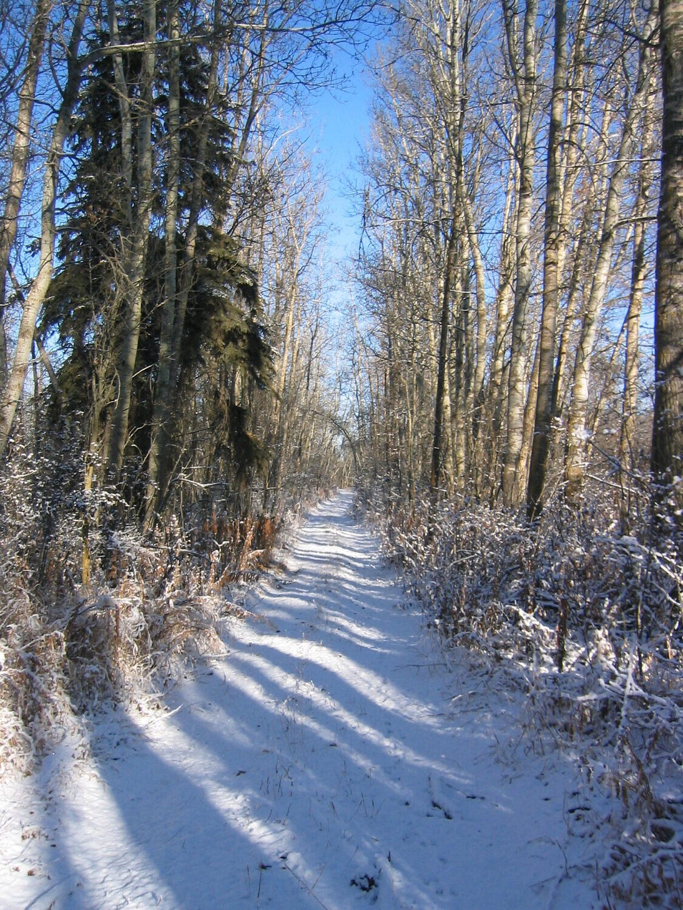
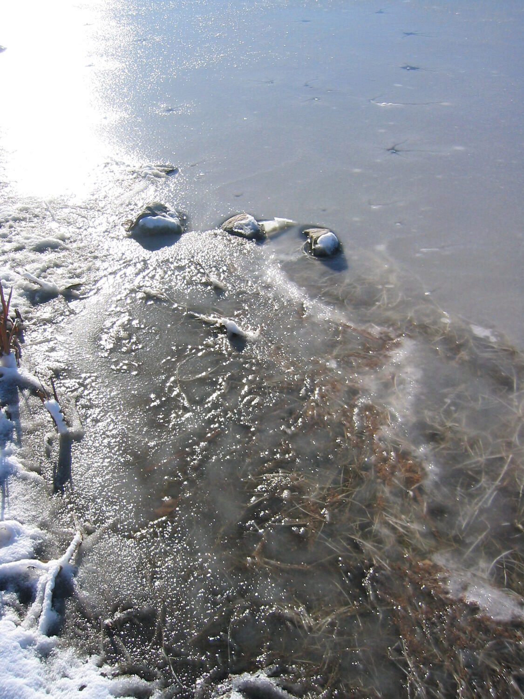

The second day of my excursions to the Cooking Lake – Blackfoot Recreational Area was on Sunday, November 4, 2007. This was good day. The first significant snowfall of the season had fallen over night, so the ground was blanketed by fresh snow. It’s funny how that is a treat, even after having lived though what seems like countless winters of waist deep snow.

I got out to the same place I’d just left the afternoon before, (if you’ve read the November 3 account you’ll know I missed ONE cache completely the day before and I was determined to go find it).

But this day had a completely different feel to it.

The fresh snow covered the trail and mine were the first human steps on the path that morning. It was fun coming up on animal trails, trying to figure out what kind of animal it was and then seeing the trail disappear into the bush. This made the trip to that one cache a real treat. Once I got close, I dipped into the bush to find the cache and not 15 seconds later a couple of women jogged by on the trail, doing a morning run. They probably wondered what happened to the big human tracks that disappeared into the bush.

I distinctly remember finding this cache. The GPSr has a margin of error of about 10 ft at the best of times. So if the person who hid the cache wasn’t very accurate with coordinates and you are about 10 feet off yourself, you know you could be looking within at least a 20 feet radius for this container....under a blanket of snow. Well, isn’t this special, you say to yourself. Where to start?

I stood in one spot, put my gloves back on ready to start swishing the snow in the area, but before I started the brain kicked in and my eye started to look for cache-worthy spots. The first such spot was right beside my foot, so I bent down to move a piece of bark and VOILA, a cache was revealed! I laughed out loud. After that initial feeling of hopelessness and discouragement, I hadn’t moved a muscle and there was the cache, a cylindrical plastic container just as advertised in the description. That was special. :-)

I had done my duty, found the one cache, so I made my way back to the car and drove around to the southern part of the Cooking Lake - Blackfoot Rec. Area looking for a backdoor entrance. The cache owner had given parking coordinates to this back door, but my keen spidey directional sense managed to miss the turn off to the parking spot the first try. I found it eventually, parked and made my way down a really neat corridor of trees, again making the only human prints that morning.

This entire walk this morning was certainly shorter than the day before, and there weren’t the same number of caches to be found, but there was something almost spiritual about the experience. I honestly felt cleansed as I walked down the narrow trail. The new snow definitely contributed to this feeling, but I think it was the remoteness of the area as well.

The animal track activity had certainly increased, possibility because of the proximity of the lake. And the lake itself seemed to be in a strange state: half rippling and half frozen. The lake was deciding what it was going to become and in a sense so was I.

I walked down the little trail, crossing a beaver damn that I’d seen in the log pictures of others, passed a little hut which seemed to used very little, and on to the cache area which promised to be on a point on the lake. The description suggested following blue diamond ski markers to the cache area, which I did, all the time wondering how anyone could ski on this very hilly terrain (Sask. roots showing there).

The path took me up an incline and finally to the tip of the point with a fairly sharp drop to the shoreline. Well, walking down that incline seems a bit hairy, so I just used my brains, so to speak, sat down and skidded to the shore on my bum. It worked pretty well.

True to form, I followed the GPSr pointer through some bush, to a spot that was close, but nothing revealed itself at first. Then I just stood and looked. Sure enough, about 20 ft away a collection of wood looked, well, too human in configuration, so I made my way over to it and under that pile was the cache container, an ammo can. I sat for a while, signed the log, took pictures of the cache and savored the find. I felt truly thankful to the cache owner for having found this spot, hiding the cache and providing me with an excuse to come walking out here, a place were things just ARE, not maybe or sort of, but just are. I wrote that sentiment of thanks in the cache log later that evening and really meant it.

I decided to snap away, creating a series of pictures in an attempt to try to capture the experience, to capture the moment. The pictures never really quite do capture the experience, but they are a valiant attempt at least. I remember being quite taken by the newly frozen water along the shoreline. Some of the pictures show the effects of the recent freeze: translucent water with bubbles and foliage trapped in what will be a solid state until spring: the first effects of a familiar cycle that has happened at this shoreline for countless centuries.

These plants had that “fly in amber” quality to them. And if the shoreline plants had feelings and they did feel distressed at being trapped in the newly formed ice, the cycle that caused the distress will in turn free and nurture come Spring. Wounds will heal. The emotional wound I was expecting to feel as a short-lived relationship was promising to come to an end at that time, well, that wound would come, perhaps make me feel trapped and distressed for a while, but would also heal in the future as well. I don’t think I consciously thought of these things while I was on the spot, but in retrospect, this process of rethinking and writing about the experience is possibly revealing why I felt like the experience of the walk that day was cleansing me somehow. The new snow was the sign of a familiar cycle; the animal tracks were a sign of resilience, perhaps of coping with whatever new reality descends.

And maybe this is simply a completely fabricated mental model painted on past experience, I honestly don’t know.

I slowly, I remember, somewhat reluctantly made my way back to the trail and then to the car. The battery on the GPSr held out the whole way. I made it to Sherwood Park and stopped at the first gas station I saw to fill up on fuel and with that had reentered civilization with it’s own man-made cycles measured by the second, minutes and hours not by the millennia.

### Photos from the day


