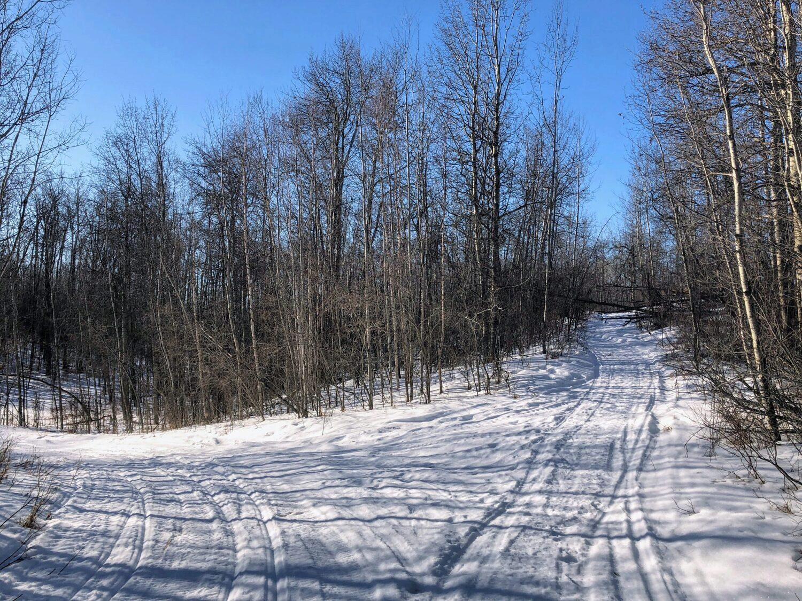

It seemed as if I was floating along the Ministik trails today.

Of course I wasn't. Gravity was actually in full force.

But during a couple of snowy hikes this winter, even when walking on snowmobile tracks, it was hard going, having to push, sink and sometimes slide in the snow with every step.

It wasn't **at all** like that today. The snow along the trails was packed down by sled tracks, but more importantly it was crusty-hard and supported my weight with every step. It was almost like walking on a sidewalk, I thought to myself.

But I didn't think too loudly, not wanting to jinx my good luck.

My goal for the day was to find two new caches hidden by Jazzhiker, a relatively new geocacher who, like me, came to geocaching via hiking. And I know for a fact that he's even a member of a hiking club, so that makes him even more of an "official" hiker than I am.

I made it a little hard on myself when I reached the large meadow at the end of the snow-packed trail. There was a fence slicing its way through the middle of the meadow that I'm quite sure I'd never seen before.

I thought I had to go over that fence, and so I did. Later I realized that all snowmobile traffic goes around the fence not 100 meters from where I veered off the trail into deep snow to go over the fence.

Oh well, live and, hopefully, learn.

There was more deep snow and much post-holing after getting over the fence, but that didn't last now. In no time I was a wide supremely packed down sled "highway" which made it easy to get to the first cache hide.

I was First-to-Find on both caches today, something that's not very common for me. After the finding the first cache, I saw the "bee-line" route would take me into a world of deep snow post-holing. Nope, that's not for me, so I continued along the sled track to my cache, checked in it and continued around along the shoreline towards the second cache.

Luckily there were sled tracks here too. These were a little softer than the others I'd been on, but still quite good and hard.

Along this stretch I saw human tracks and as I got closer to the cache I was 100% sure they were the cache owner's tracks laid down as he was hiding the his cache. That made it quite easy to make my way straight to the cache, aside from the fact that I had a GPSr device in my hand.

The cache was found quickly.

My this trek was working out well. I still had lots of energy and was having fun making my way over ground that was new to me. On the way back, I was forced to cross a fence again, but after that blessed sled tracks kept me away from the deep snow. In fact, I followed those tracks to take the long way back to where I needed to go versus bee-lining the shortest route possible.

Sometimes the long way is the easiest way.

The trek back along the trail was uneventful, but I noted that with the temperature increasing, my tracks from the walk in were completely melted away.

It was indeed the first last of spring and the memories of that long, cold February will be erased too.

### Photo Gallery


