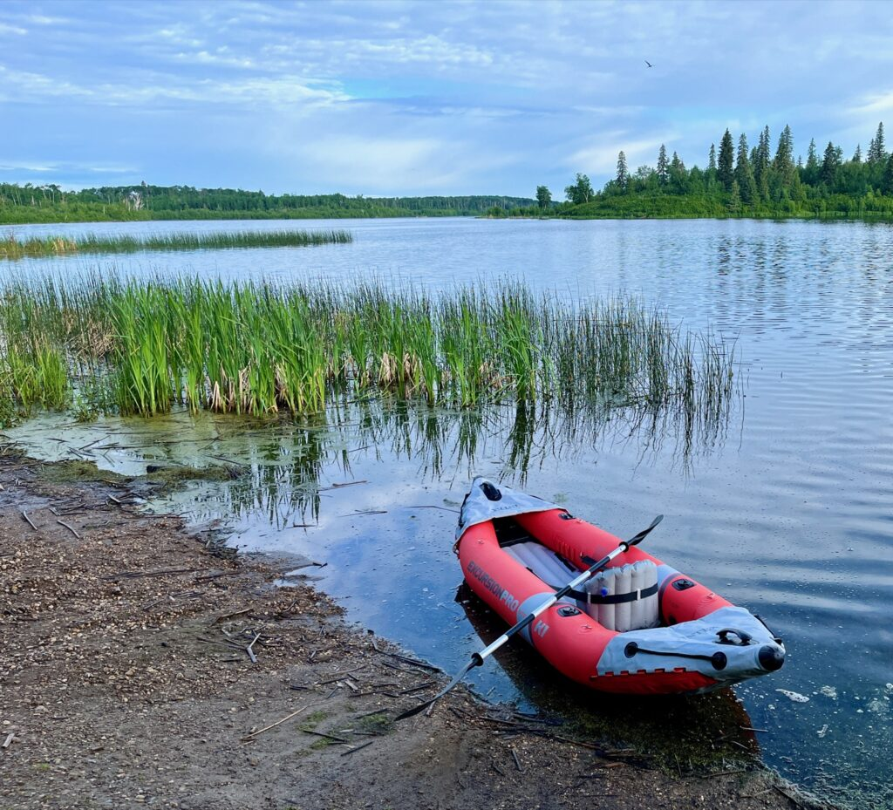
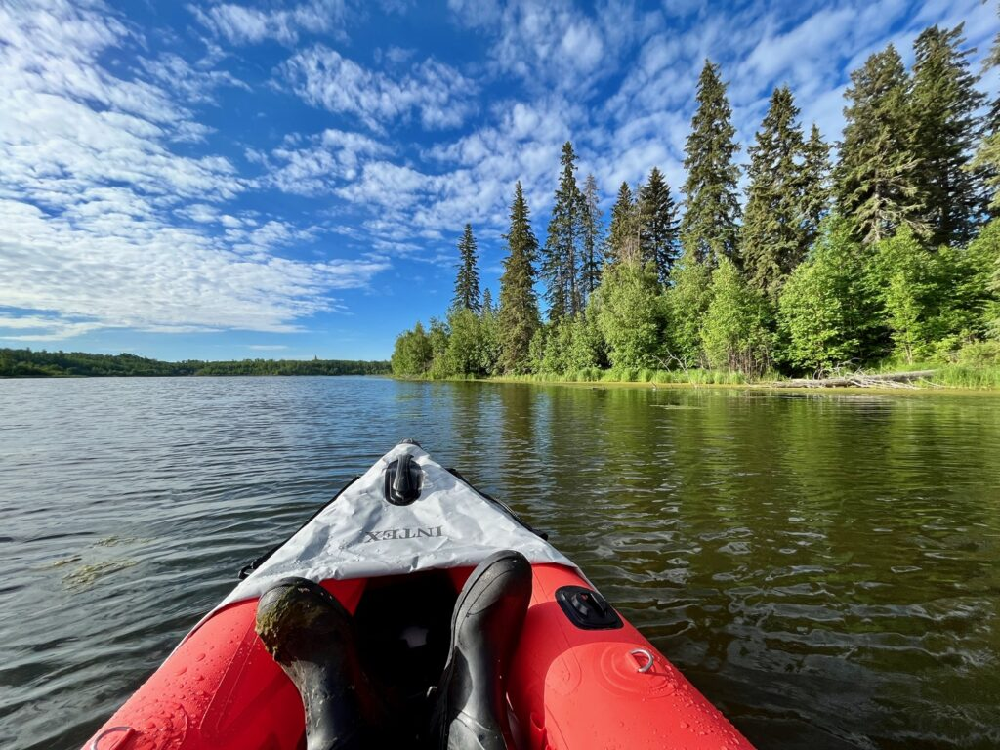

Despite the title of this blog I'm including a post about an outing where **no tracks at all** were left behind.

What, was I levitating? Well, no, but I **was** floating, and was happy to have stayed that way throughout the entire maiden "voyage" of my inflatable kayak this morning.

After a couple of years of deliberating about purchasing a kayak, I finally broke down and bought one late in the fall of 2021. I decided on an inflatable kayak mainly because of the ease of transporting it to wherever I was going to use it. You simply take it out of its carrying bag, inflate the three separate chambers - bottom, right side and left side - attach a "skeg" to the bottom for better control and be on your way.

That's the upside.

The downside is what you have is essentially a streamlined, yet still bulky **_dingy_**, a water craft that isn't really built for speed or appropriate for long trips. I decided I didn't care very much about either speed or long trips so the ease of transportation won out in the end.

And this week was the first time I'd actually used the kayak in the wild.

A couple of days ago I drove out to [Islet Lake](https://goo.gl/maps/7txfFDiomJKbWucD6) in the [Cooking Lake-Blackfoot Provincial Recreation Area](https://www.albertaparks.ca/parks/central/cooking-lake-blackfoot-pra/) , got the kayak inflated and proceeded to learn "on the job" as I attempted to launch the kayak with me it in and then paddle around the cove. I got about 150 meters from shore about 4 or 5 times that day and was happy with just having gotten out on the water. The wind was blowing in some big dark rain clouds from the north which cut my visit short that day.

Today, I was out to the same spot much earlier in the morning and this time the lake water was like glass. It was liberating to "break free" from the 150 meter limit I was comfortable with a few days before. I made my way around a large island in the center of the lake and then generally meandered around to different small islands before heading back to where I'd launched.

This is on the east side of the largest, central island

It was lot of fun just finding myself in this "new" environment, and being able to view these island while drifting along in the water. I'd seen them from these angles before years ago but that was by walking between islands on the frozen lake during winter.

And there was a surprise, when I reached my launching spot on the shoreline: I realized my left leg was pretty well completely "asleep". That made getting out of the kayak interesting to say the least.

I still have a **lot** to learn, no question there. My paddling technique feels closer to "flailing" than an actual paddling. But it's a start.

All in all, it was a fun and successful first paddle flail.

## Image Gallery


The kayak deflated again after the paddle
