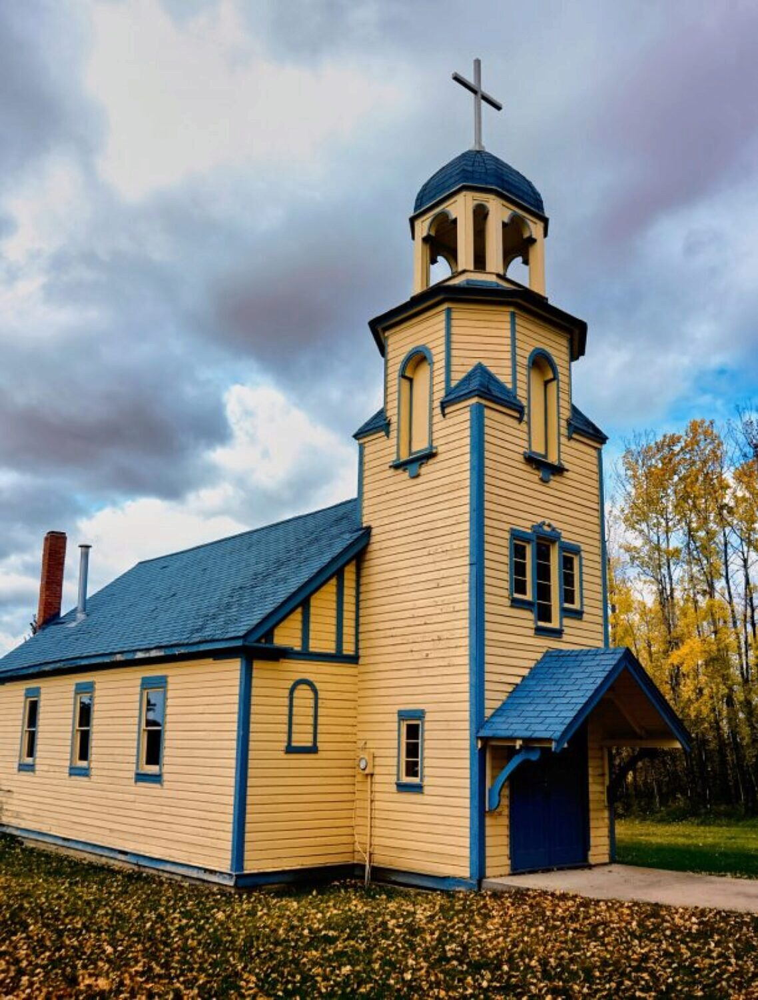

Our Lady of Perpetual Help Roman Catholic Church and Cemetery lies 32 kms northeast of the town of Athabasca, Alberta and serves the Spruce Valley district.

The church is painted with an unusual colour scheme compared to the many other churches I've visited in rural Alberta, and it seemed to match fall colours surrounding it.

And I, for one, kind of **like** it.

The small cemetery is situated behind the church and is well-kept. Strangely, the cemetery is listed as "Mother of Perpetual Help" on all the cemetery-related internet databases, so searching for it using the name on the sign on the grounds makes it somewhat difficult to find on the web.

### Photo Gallery

Click on any image to see a larger version.

### Location

<iframe style="border: 0;" src="https://www.google.com/maps/embed?pb=!1m18!1m12!1m3!1d2353.095801606798!2d-112.85535468410377!3d54.86344478032476!2m3!1f0!2f0!3f0!3m2!1i1024!2i768!4f13.1!3m3!1m2!1s0x0%3A0x0!2zNTTCsDUxJzQ4LjQiTiAxMTLCsDUxJzExLjQiVw!5e1!3m2!1sen!2sca!4v1570720183138!5m2!1sen!2sca" width="100%" height="450" frameborder="0" allowfullscreen="allowfullscreen"></iframe>
