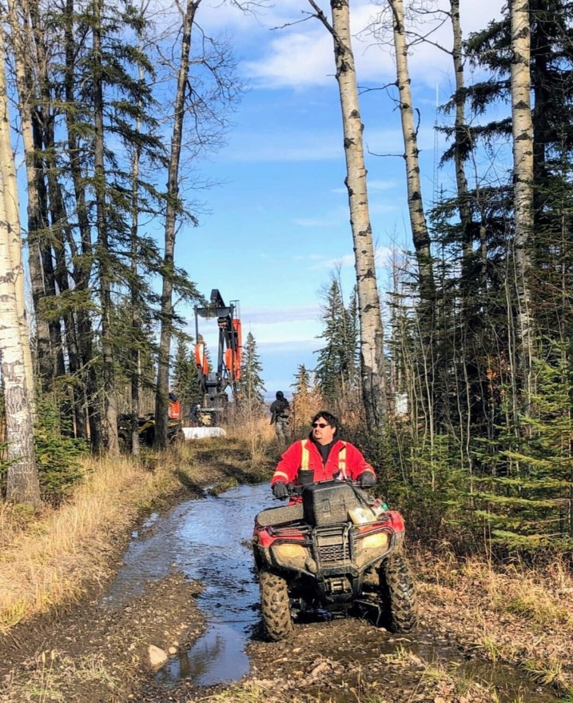
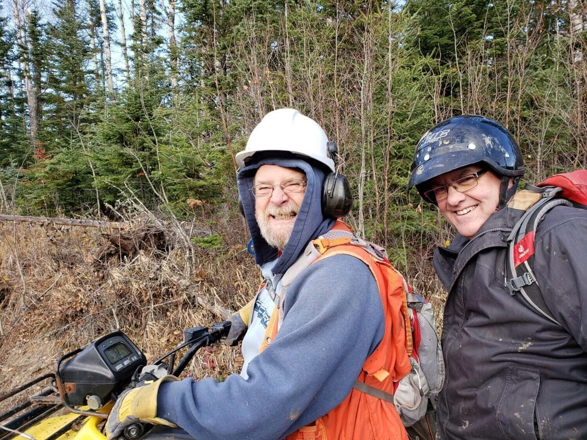
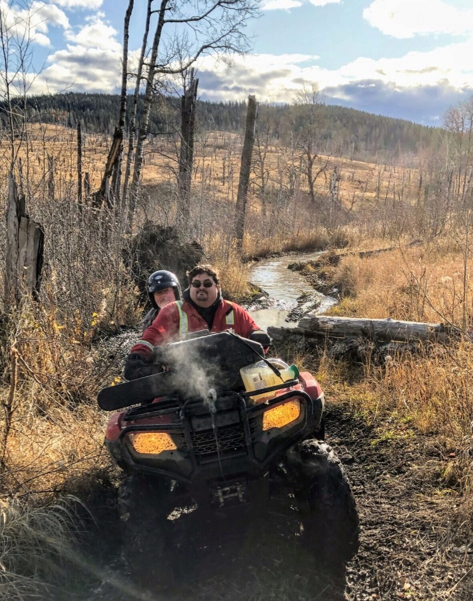
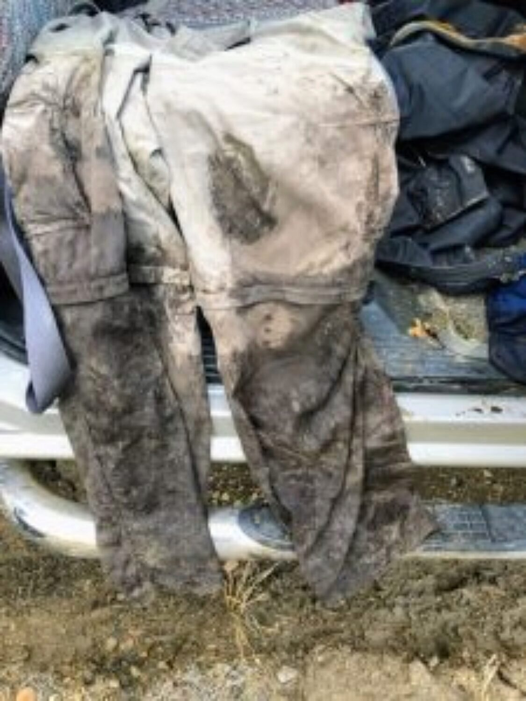

> “If you reach for the stars, you just might land on a decently sized hill.”
> ― Stuart Hill, The Cry of the Icemark_

I’d say the four guys who made it to Grizzly Ridge Tower on Sawridge Hill southwest of Slave Lake today weren’t exactly reaching for the stars; we were all out to experience the terrain and find some geocaches as prizes along the way. Yeah, that's about it, really.

But while doing that, we did manage to make our way up a decently sized hill.

And to do that we travelled by quad and at times, two of us at least, on foot when the terrain got too dicey for doubling up on the quads. It was a 20 km round trip along grassy, hummocky terrain, deteriorating former roads, and around and through a LOT of bathtub- and small swimming pool-sized mud holes.

Was it worth it? You’re damn right it was. Here’s what happened.

### Staging

After meeting at a restaurant mid-morning, we made our way west out of town in a convoy of three trucks, Dwaine and Bryan with their quads as cargo.

After leaving Highway 2 and travelling about 9km south on Canyon Creek Road, we came to a convenient, but pretty muddy pull out. This was near the “Amazing Tree” cache, where we planned to start our trek today.

Bryan, Hugh and I left Dwaine to unload his quad while we scampered further south to find a cache that Dwaine had hidden about a week ago. The road near the cache was muddy and in fact a truck was stuck in the mud fairly close to the cache when we arrived. With the help of a buddy, they’d gotten themselves unstuck and were gone by the time we all were ready to make the walk over to the cache. It was found quickly and we all signed in as “First to Find”-ers.

Once we returned to staging area and were ready to go, the two-quad convoy began with the first stop being the “Amazing Tree” a cache and a tree which were unfortunately mostly destroyed in the [2011 Slave Lake wildfire](https://en.wikipedia.org/wiki/2011_Slave_Lake_wildfire). Even so, that tree is still a sight to see.

We then struck out eastward across a few spots with fairly challenging terrain, but tame compare to what we’d see later in the trip. The next major waypoint was meeting up with the road that once connected the area near Grizzly Ridge to the south with Highway 2 which passes through Slave Lake and the city dump to the west where this road originates.

### It’s a Road That Has Seen Better Days

The road is no doubt a shadow of what it once was, the little traffic it sees not damaging the weeds that are beginning to reclaim it.

Not too long later we reached the steel hulk of a bridge that had been burnt out by the [2011 Slave Lake wildfire](https://en.wikipedia.org/wiki/2011_Slave_Lake_wildfire) and subsequently dragged up the hill from the creek it once crossed. There’s a cache, “Burnt Bridge”, hidden here by Bryan, one of our group, so three of us dismounted and began our search for it. It took a while, but Dwaine was finally able to come up with the goods. Having the owner the cache with us tossing out hints didn’t hurt either.

The next leg of the trip was relatively straightforward. We were on a actual road, with only minor obstacles to go around or over. That was the case until we got to “Grizzly Gateway”, another new waypoint on the earth now named for a geocache hidden there.

### Past the Gateway, Things Get Gnarly

Past the “gateway”, that is, past where any four-wheeled vehicle has gone for years and I dare say no four-wheel vehicle **could** go these days, the trail gets real gnarly.

My track log shows that the 2.8 km of trail to the top of the ridge took me 1 hour and 25 minutes to travel. That’s because the obstacles the quads met in this section, one getting briefly stuck in a bog and both being stopped up by a large piece of deadfall that had to be chainsawed into pieces and removed before we could continue.

And as a passenger there were spots where it just wouldn’t have been safe to go through doubled up, so to get off I would shoot my not-so-small leg up toward the sky — groan like a bull moose just because it helped — and swing the leg around behind Dwaine’s back to dismount and, yeah, sometimes just roll off the back of the quad like a sack of potatoes.

Sometimes just me and at other times Hugh and I would walk through and around the dicey spot or up a slope to return to the waiting quads. That all took a while and, yes, it took a bit out of the walkers’ gas tanks. But it couldn’t be helped.

### I Don’t Need No Stinking Rubber Boots!

This section of the trail wasn’t without comic relief, which I supplied. As I was attempting to make my way through a nasty bog that had stopped up the lead quad for a bit, I took a wrong couple of steps, and sunk to my knees in mud. But there was still forward momentum so, suddenly I was on my knees falling forward into even more mud with **both** of my old black farmer-type rubber boots ripped off my feet, and impossibly stuck in the filthy ooze.

It took a two-armed heave to retrieve the boots from the massive suck of the mud hole. After that my feet were so soaked and my pants so filthy that getting muddy or getting my feet wet didn’t really matter anymore. Bonus!

And for about three - or was it four or five? - more times during the afternoon, I lost a boot again after sinking into the muskeg ooze of mud hole that needed to be crossed on foot.

It was all part of the fun.

### Grizzly Ridge Tower

 at the tower.")

Nearer to the top of the ridge, both Hugh and I needed get off the quads to trudge to the top because the slope at that point made it just too dangerous to double up on the machines.

We made our way - oh, so slowly - to the top and then rested within sight of the tower, both of us too winded to march any further. Upon recovering, the tower was a such a cool sight. Its exterior looks weather-beaten but it’s been refurbished with new ladder-stairs so it’s very safe to climb.

After retrieving the ultimate prize, Grizzly Ridge Tower Cache, hidden not too far away from the tower, we all eventually climbed the tower to take in the expansive view. There’s a lot of nature out there, plant, tree and animal and it it’s all part of a protected area, [Grizzly Ridge Wildland Provincial Park.](https://www.albertaparks.ca/parks/northwest/grizzly-ridge-wpp/information-facilities/#)

### 360 Photo From the Tower

_Grab the image with your mouse and twirl it around to see more._

Post from RICOH THETA. - [Spherical Image - RICOH THETA](https://theta360.com/s/gl6WTLmpan8UvhDI0JN58Zjwu)

### Return Trip

It was time to make the trip back. The nastiest section of the trek had to be travelled again and even though we’d already covered the ground between the tower and “gateway”, I was still continually impressed at what kind of nasty terrain these quads could go through.

I’ve had precious little experience driving quads - some in my teens in Saskatchewan and then later in my late 30’s on the Arctic tundra in Nunavut - both relatively flat-terrain, fairly dry places. This terrain was not that, so I learned a lot and have far more respect for the drivers who can deftly maneuver the machines through hellishly nasty terrain.

***
    

***
We returned by an alternate route, opting to take an east-west quad trail just north of the “gateway”. Dwaine had gotten a scouting report from his neighbour about this leg and so we thought it would be at least passable.

There were a couple of very nasty spots along here, no question, but all-in-all it was a good decision to return this way. It seemed like the “fight” of staying on the back of the quad actually seemed to pass more quickly now. Was I getting used to this or was I just getting numb?

Soon, after getting through a very nasty spot and descending a steep hill, we reached an actual road, maintained by an oil / gas company operating the area.

A real road. And we made real time.

### Back to the Staging Area

On the way back to the staging area, we covered some of the same ground that three of us had travelled earlier that day to get Dwaine’s cache before our trek. It was cool actually recognizing familiar ground, a first for me during the trek through this new area to me.

Since these were good roads we could pick up the pace, and soon we were back at staging area where high fives were in order.

But there was no time to rest. From the south a nasty rain squall was coming up on us quickly and before we could get out of there, nature congratulated us with some large cold rain splats. There was no big downpour, thank goodness, but that potential wetting of this road, which we had seen on the way in was greasy enough in some sections, made the guys load their quads with that much more haste.

It was such a great trip today and **huge THANK YOU’s** go to Dwaine and Bryan who man handled their quads with two bulky passengers for the 20 km round trip. It was the highlight of my outdoor experience this year, no question.

### Epilogue

Three days later, I’m pretty sure I can still feel the indents in my butt from the metal rack that was my seat at the rear of the quad.

But I’m very sure that I’ll feel the impact of the experience of the trip for a much longer time to come.

And for some comic relief, this is what my pants looked like after stopping along Canyon Creek road before arriving back in Slave Lake.

Amazingly, after an overnight soak, they washed up looking like new the next day.

### Photo Gallery




### The 20 km Route Today

_Click on the "Play" button in the middle of the map and then click the individual waypoints to travel to and view a picture at that spot._

<iframe width="100%" height="576" src="https://maphub.net/embed/71260?geolocation=1&amp;panel=1" frameborder="0"></iframe>
