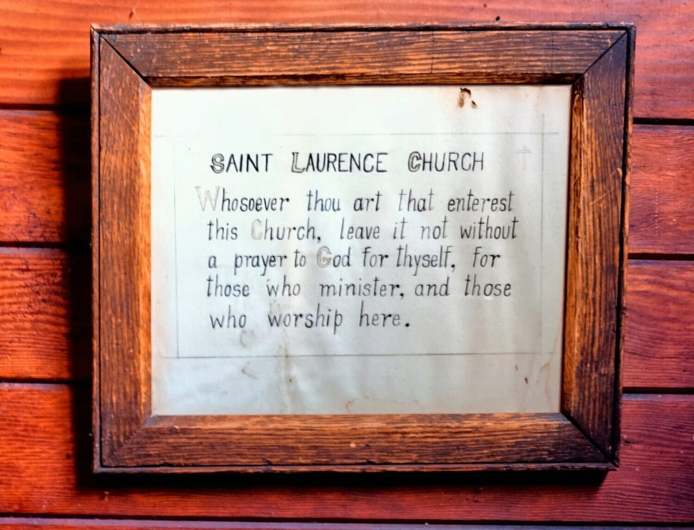
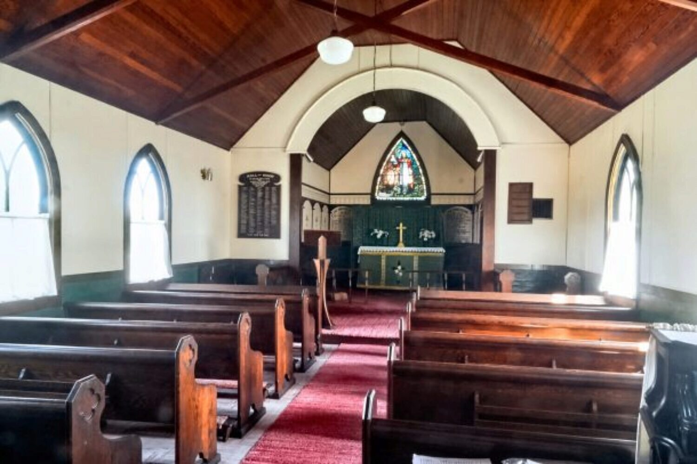

St. Laurence Anglican Church is located in the hamlet of Monitor, Alberta. Constructed in 1915, it is registered in the Canadian Register of Historic Places.

It’s been home to the local Anglican parish for over a century, but at times was also the meeting place for Methodist and Lutheran congregations and served as the hamlet’s schoolhouse, public library and as a meeting place for the Boy Scouts and Red Cross when the need arose.

It seems to me, the church has been one of the true hubs of the community over the years.

When I visited on a summer day in 2019, I admit that it was a geocache hidden **in** the church (that’s unusual) that lured me here initially. But as so often happens with the hobby, even though the geocache was very nicely done and craftily hidden, it was the place I was lured to that made a lasting impression.

After parking nearby, the front walk led me past the church's welcome sign, and to an unlocked door, not something you’d generally find in the city or most small towns, I'd say.

The somewhat cramped musty, darkish vestibule gave you little choice but to notice and read the framed invocation on the wall, a reminder to pray for yourself, and for those who worship here including those “ministering” and those “worshiping”.

It struck me that this reminder (or was it closer to being a command?) was simply asking me to act outside of myself, to send a “prayer”, as I would frame it, good **karma** to others.

That set a kind of tone for my whole visit: I was being asked to at BE present and even to DO something during my visit to this place. I was no longer just a passive visitor.

A second door opened to the church itself, and revealed five rows of pews all bathed in the summer sun radiating through the windows. The creaky floors, the Story & Clark organ and impressive stained-glass windows on the far wall gave me the feeling that I wasn’t in an _everyday_ place. That’s exactly what a church is supposed to do: take you out of your “normal” world and transport you by being a physical space that reminds you of an “other” space, no matter how you conceive of that.

After finding the geocache, and admiring it, I signed the church register near the organ and couldn’t help lingering a while to admire the church itself.

As I write now, in a sense, I’m obeying the invocation in the vestibule: with these words, I’m offering a “prayer” to the place and the local people who continue to maintain it.

Source: [HeRMIS](https://hermis.alberta.ca/ARHP/Details.aspx?DeptID=1&ObjectID=4664–0202)

### Photo Gallery



### Location

<iframe style="border: 0;" src="https://www.google.com/maps/embed?pb=!1m18!1m12!1m3!1d2457.5495643988024!2d-110.57123804880246!3d51.97863628386!2m3!1f0!2f0!3f0!3m2!1i1024!2i768!4f13.1!3m3!1m2!1s0x0%3A0x0!2zNTHCsDU4JzQzLjEiTiAxMTDCsDM0JzA4LjYiVw!5e0!3m2!1sen!2sca!4v1573518542124!5m2!1sen!2sca" width="600" height="450" frameborder="0" allowfullscreen="allowfullscreen"></iframe>
