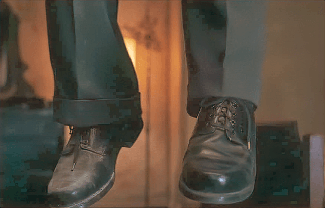
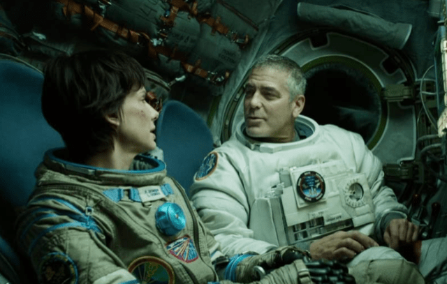

Some movies stand out from the rest. Often that’s because they do a good job of dramatizing situations from which you can learn essential truths about the human condition. _The Shawshank Redemption_ and _Gravity_ both excellent example of doing just this and both are worthy of your time and attention.

These are very different movies, but they share one identical message at a crucial point in their plots: if one decides not work to improve present circumstances and instead simply passively accepts whatever circumstances fate has provided, one becomes essentially “dead.”

It’s a choice we humans are making constantly: do we chose the “safe” stasis or the risky path to “becoming” and growth.

First, _The Shawshank Redemption_. The movie was adapted from Stephen King’s novella _Rita Hayworth and Shawshank Redemption_ and released in 1994. Although critics seemed impressed, and it was nominated for seven Oscars that year, but won none. And it “landed with a hollow thud at the box office,” in the words of the director, Frank Darabont.” Since then, however, this movie it has grown in popularity to the point where it is the [highest rated movie on IMDB.com](https://www.imdb.com/title/tt0111161/?ref_=nv_sr_srsg_0) and has been for years.

Why the initial cool reception by the general public? Most people probably assumed the movie that is set in a prison that depicts the lives of prisoners was a movie about prison life and the lives of prisoners. It’s not that at all.

It’s a movie about **life,** any human’s life …in a metaphorical prison of the someone’s own making. This is not the kind of prison that has walls. It’s a psychological prison we either build for ourselves or allow others to build for us.

The main character is Andy Dufresne, played by Tim Robbins. He’s a man wrongfully convicted of killing his wife and her lover. Once in prison, he’s the one who ordered a rock hammer through the black market run by Red, played by Morgan Freeman.

He’s also the one (spoiler alert!) who took years to tunnel - mere pocketfuls of ground down prison wall at a time - out of his cell to eventual freedom.

At a crucial point in the plot we hear the memorable, quotable words: “I guess it comes down to a simple choice, really. Get busy living or get busy dying_.”_ It’s only after we realize he’s escaped that Andy has been choosing to “get busy living” almost the entire time he’s been locked up in prison.

When we see that Andy has been chiselling away at the tunnel hole in the wall of his cell for years see understand that he’s consistently chosen to **not** simply accept his present circumstances. Instead, despite the risk of being caught, Andy is doing what he can do to provide himself with hope for the future.

We all know it’s more comfortable **not** to take a risk. Instead we simply fit in, acquiesce to the loudest voice in the crowd, float along being defined by others. That’s a choice we make and it leads to a life in “prison.” Brooks Hatlen, a lifer, is an extreme example of this choice in the movie, and the message is clear: if you can’t leave your own mind-made prison, you might as well be dead.

In the movie, the head guard Byron Hadley snarls out the reality of prison life to the new prisoners: “You eat when we say you eat, piss when we say you piss and shit when we say you shit.” A more elegant way of saying the same thing is, being stuck with others’ definitions of you, with the scripts that others write for you, the expectations that others define for you is a sure way to imprison yourself.

As Red explains, Brooks is an example of someone “institutionalized,” so used to the confines of prison life that he can’t function outside of it. It seems his hope was snuffed out long before we meet him. And after he’s released, Brooks can’t endure freedom and in the “fight or flight” urges produced in the lower brain stem, he decides for “flight” in the extreme by taking his own life.

## _Gravity_ - Different Movie, Same Message

“Get busy living or get busy dying”. Dr. Ryan Stone, played by Sandra Bullock in the movie _[Gravity](https://www.imdb.com/title/tt1454468/?ref_=ttmi_tt)_ is faced with this same decision. Life can be shitty and just how will you decide to react to that? You can decide to give up and just take it, or you can get up the courage to work your way through it somehow. It's the same call to action, just stated differently and in a completely different context, this time in space in low earth orbit.

In _Gravity,_ released in 2013, after the International Space Station has been wiped out by the orbiting debris of a destroyed satellite, both Ryan and veteran astronaut Matt Kowalski, played by George Clooney, are left to survive in space. Circumstances force Kowalski to cut the tether between them so that Ryan can survive. He drifts helplessly into the void of space, and because of this courageous act, Ryan - eventually - makes her way to a Russian Soyuz module and is able to get safely inside.

She’s now safe in a womb-like space capsule but finds that its thrusters are completely out of fuel. She’s adrift. All the frantic scrambling she has gone through with Kowalski and his sacrifice of his life for hers has still come to nothing. She faces a slow, cold and lonely death.

After repeated attempts to contact Mission Control, Ryan manages to connect with Aningaaq a man back on earth who happens to be using a ham radio. There is a touching back and forth between the two, but seemingly resigned to her fate, Ryan simply turns the dials in the spacecraft to decrease the oxygen supply to nothing in an attempt to speed her death.

She asks Aningaaq, now the only human contact she has, to sing her to sleep.

Despite this, her subconscious has other plans. It has decided to “get busy living.”

In quick succession, we see Matt Kowalski thump on the Soyuz hatch window, open the hatch from the outside and swing himself into the spacecraft.

We see Kolwalski there, bantering about his new record time in space, finding the bottle of vodka he knows is stashed under a Soyuz seat and turning on the lights to brighten the mode of the place. But we know very well he can’t be real. This is Ryan’s mind rebelling against the decision to quit on life.

As the “two” converse, Ryan enumerates the reasons why she’s completely out of options, why there’s no hope. Kowalski interrupts the pattern of defeat:

> I get it, it’s nice up here. You can just shut down all the systems, turn out all the lights... and just close your eyes and tune out everybody. There’s nobody up here that can hurt you. It’s safe. I mean, what’s the point of going on? What’s the point of living? Your kid died. Doesn’t get any rougher than that. But still, it’s a matter of what you do now. If you decide to go, then you gotta just get on with it. Sit back, enjoy the ride. You gotta plant both your feet on the ground and start livin’ life.

This is Ryan’s subconscious piping up: saying you have to “get busy living or get busy dying.”

No matter what you choice you make, you are always carrying through on some kind of action. You can choose a path that you believe will lead to growth and becoming or a path of inaction that seems safe yet ultimately leads to a “dead” life, a life of “Living and partly living” to borrow a phrase from the poet T.S. Elliot. 

These two movies have multiple themes but it seems to me this universal message they have in common is what makes them so satisfying to watch. That message is that in each moment of our lives we need to make choice between living - despite the pain, sometimes suffering that comes with it - and “death”, a passive life scripted by others.
