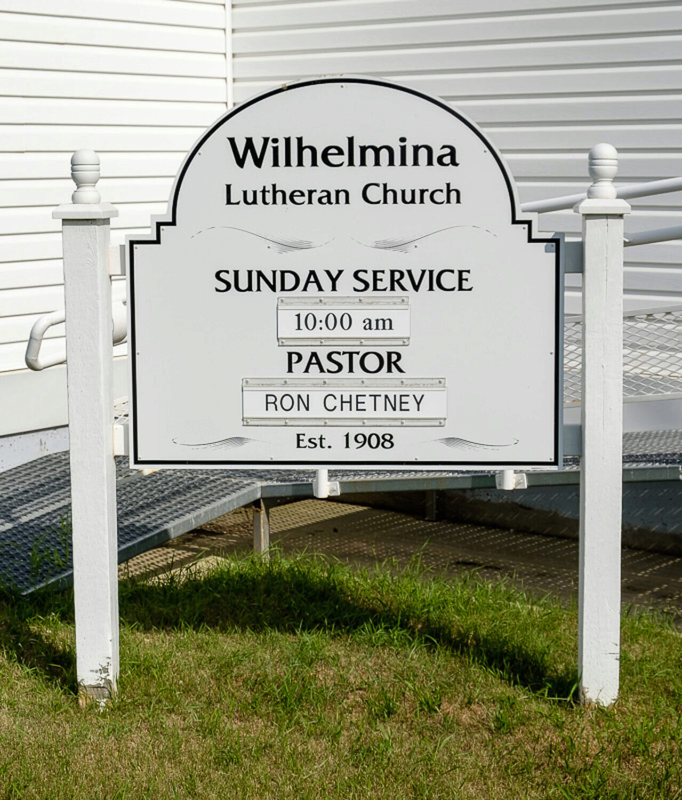
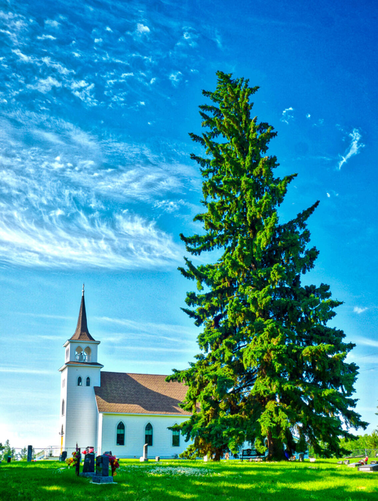

When I parked in front of the Wilhelmina Evangelical Lutheran Church near Hay Lakes I was immediately struck by the nicely-built and obviously well-kept church. The place made a strong and positive first impression.

I was there primarily to visit the adjoining cemetery to see if I could add to a “cemetery photo” project I’d started up a couple of weeks before.  In the end though, most of my keeper photos turned out to be of the church itself.

As detailed very well on the church’s website, the majority of the people in the area, the "Wilhelmina community", immigrated from Vilhelmina, Västerbotten in the northern part of Sweden. There the church played a large role in their lives and once settled in this area of Canada, some were attending Fridhem Lutheran Church, about 10 miles away. Many, however, felt the need for a local church closer to home so that families could attend.

[The church website](http://www.wilhelminachurch.ca/)  details the options considered for the church’s location, and the political fallout from the choice, but after all this work began on the church at the present location in 1912. The work was finished the next year, an organ purchased in Winnipeg (for $114.30) and over the next 5 years money was raised to pay for internal furnishings like the altar, lectern, and pews. Years later, money was raised for a church bell purchased for $221.47 from the St. Louis Bell Foundry in St. Louis, Missouri.

[The church website](http://www.wilhelminachurch.ca/history/a-new-church)  goes on to provide many more details about additional changes and enhancements to the church and using the date of the first initial meeting regarding the building of a church in November, 1908, the endeavour’s centennial was  commemorated in 2008. The place certainly doesn’t look 109 years old, a testament to how well it was built and how well it’s been maintained since.

Source: [http://www.wilhelminachurch.ca/](http://www.wilhelminachurch.ca/)

### Image Gallery


### Location

<iframe src="https://www.google.com/maps/embed?pb=!1m18!1m12!1m3!1d2389.548757080851!2d-112.93118474849234!3d53.208008479851856!2m3!1f0!2f0!3f0!3m2!1i1024!2i768!4f13.1!3m3!1m2!1s0x530aa12ed2fd0bbb%3A0x54044c5535106704!2sWilhelmina%20Evangelical%20Lutheran%20Church%20and%20Cemetery!5e0!3m2!1sen!2sca!4v1594788942329!5m2!1sen!2sca" width="800" height="600" frameborder="0" style="border:0;" allowfullscreen aria-hidden="false" tabindex="0"></iframe>
